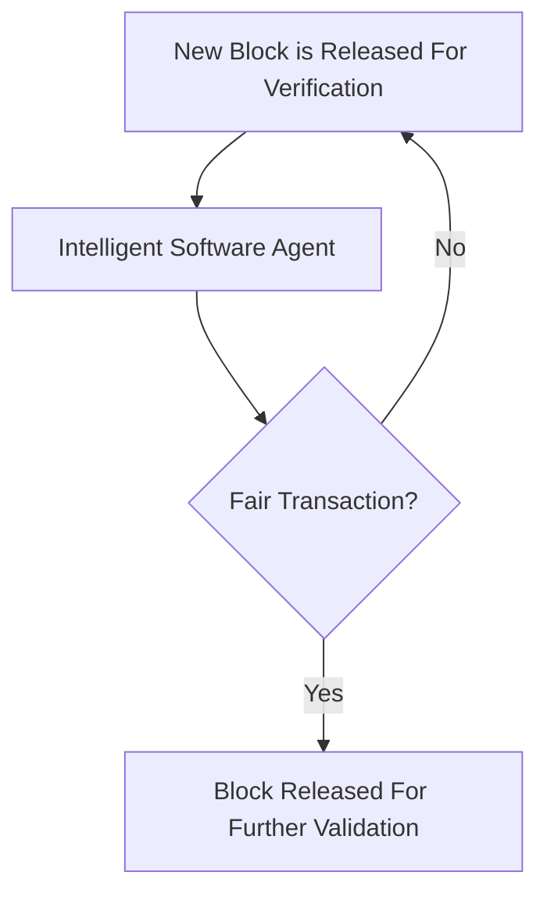

Dey S. A Proof of Work: Securing Majority-Attack in Blockchain Using Machine Learning and Algorithmic Game Theory[J]. International Journal of Wireless and Microwave Technologies, 2018, 8(5): 1-9.

## Abstract

多数人攻击(majority-attack)对公链网络可能不是一个威胁，但对联盟链来说则不是这样，因为联盟链部分成员可能串通作恶。本文提出了一种使用监督机器学习和博弈论理论的方法，利用智能软件代理(Intelligent Software Agent)来监控区块链网络中利益相关者的活动，从而检测诸如串通等异常。

## Methodology

根据[Rosenfeld](https://arxiv.org/pdf/1402.2009.pdf)的研究，确保攻击者攻击成功（双花攻击）的概率在10%，1%和0.1%以下需要确认的区块数分别为2，4和6次，而一旦攻击者的hashrate超过全网hashrate的一半，不论确认多少区块，都将无法阻止攻击。与此同时，考虑实际执行攻击的可能性，假设商品价值为v，攻击者挖了o个区块，每个区块的价值为B，如果攻击成功，攻击者将获得价值v，如果攻击失败，攻击者将失去价值v+oB。综合考虑这两个方面，攻击者的回报`payoff(s)`符合如下公式：
$$
s = \begin{cases} 
	{ v , } & { \text { if } q \ge 0.5 } \\ 
	{ - ( v + o B ) , } & { \text { if } q < 0.5 } 
	\end{cases} \tag{1}
$$

其中q是hashrate。该回报函数可以用来对是否可能发起攻击进行判定。由于攻击的结果只有两种：成功或失败，因此可以从博弈论的视角进行分析，一些博弈论的术语如下：

1. Self-Interested Agents：可以是任意实体如个人，公司或其它机构。这些实体是区块链网络的一员，拥有自己的偏好和效用，可能是诚实的或恶意的。
2. Player：参与区块链网络的每个Self-Interested Agents。假设这里有N个players：`N = (1,2...,n)`，N为有限集合，并由i索引
3. Action：每个player基于它们的偏好和效用执行的动作，假设player i 执行的一组动作为Ai = (a1, a2, an)
4. Payoff：每个palyer收到的奖励

回报函数`payoff(s)`可以重新表示如下：
$$
u(a)=\begin{cases}
	{v,} & {\text { if } q \ge 0.5} \\ 
	{-(v+o B),} & {\text { if } q \lt 0.5}
	\end{cases} \tag{2}
$$
其中u是效用，a是攻击者采取的动作，q是攻击者的哈希速率，v是商品/服务的价值，o是挖掘的区块数，B是每个区块的价值。

该回报函数将根据商品/服务的价值来判定攻击者是否会发起攻击，我们可以将此回报函数提供给监督机器学习算法，对攻击是否可能发生进行分类。如果攻击可能发生，系统将实施一系列规则阻止区块链确认来自攻击者的交易或者阻止交易直到发起新的公平的交易。

要实现这一想法，可以实施一个建立在区块链应用层上的智能软件代理，该软件代理由两部分组成：

1. 基于过去的交易历史判定利益相关者攻击的可能性
2. 基于当前交易中涉及的商品/服务的当前价值判定利益相关者攻击的可能性

一个工作流如下图所示，新的区块发布到网络中后，应用层的智能软件代理将使用回报函数根据利益相关者的动机和当前商品/服务的价值进行分类。如果利益相关者的动机被认为是恶意的，将要串通发起多数人攻击，该交易将被取消，所有利益相关者将被请求发起新的交易。这里，商品不一定是网络中有实际价值的东西，有可能是对利益相关者重要的或关联紧密的东西，这种情况下，智能软件代理需要推断当前交易中商品/服务对利益相关者的重要性或关联程度，以便计算回报函数，从而得出多数人攻击发生的概率。

## Discussion

短短四页的论文仅仅是阐述了一个基本思想，作者可能只是想占一个坑，但这一思路却非常值得借鉴。至于异常检测的逻辑是定义在智能合约中还是定义在共识代码中，就有待之后仔细分析了。

